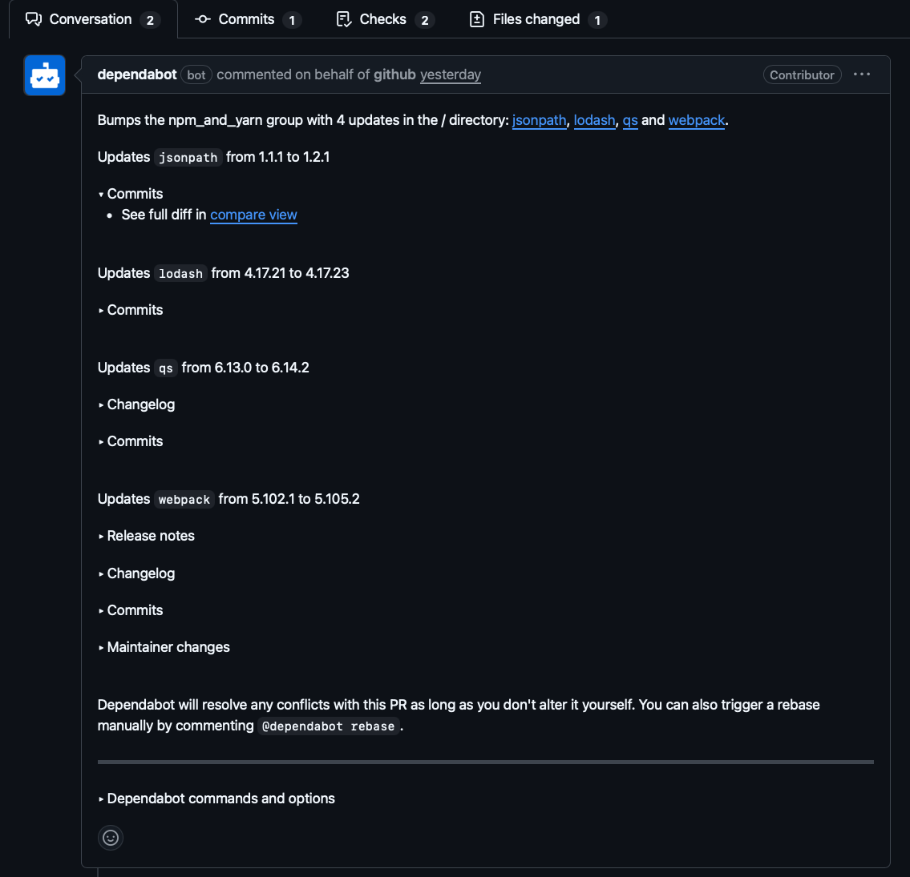
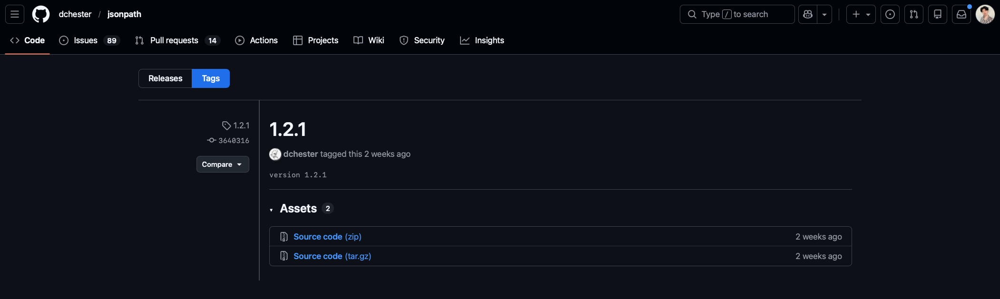
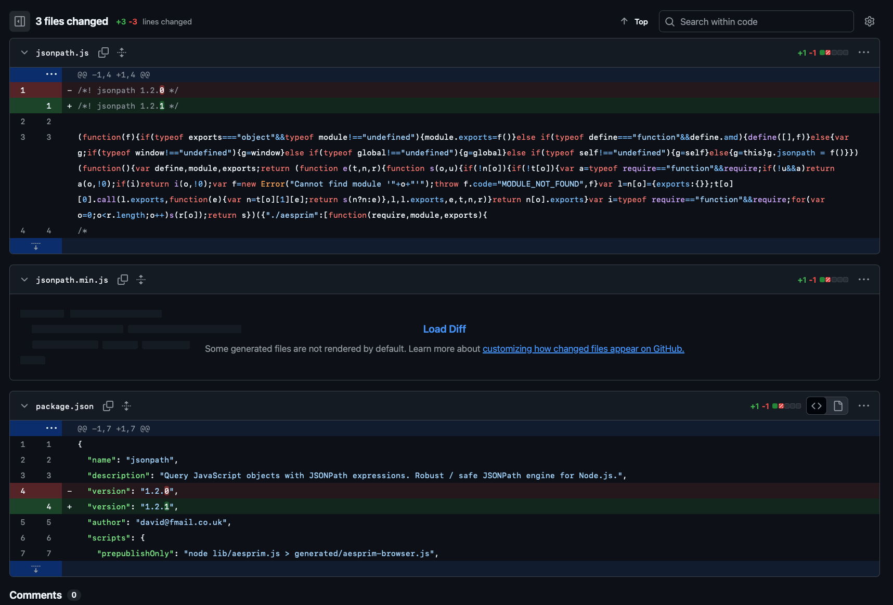
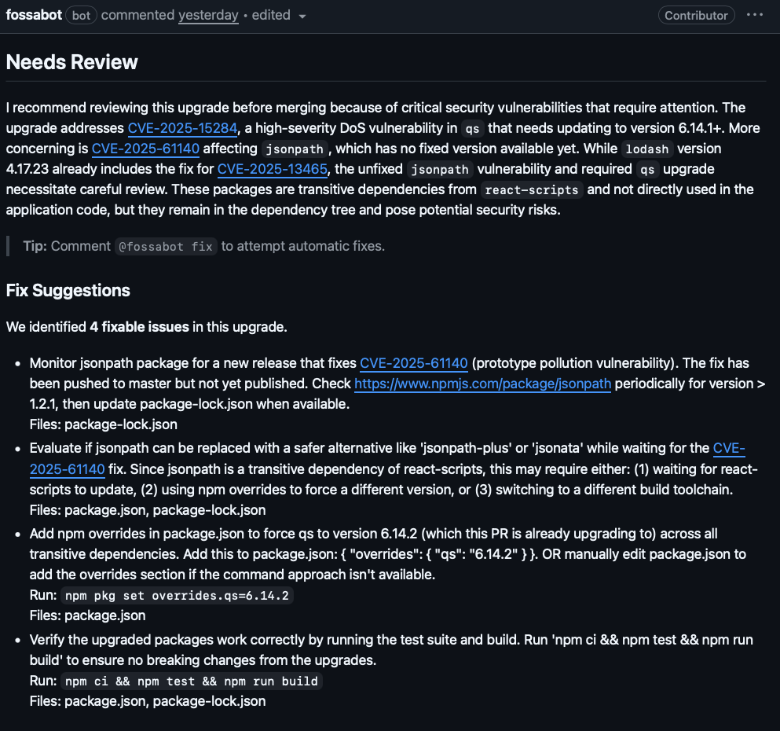
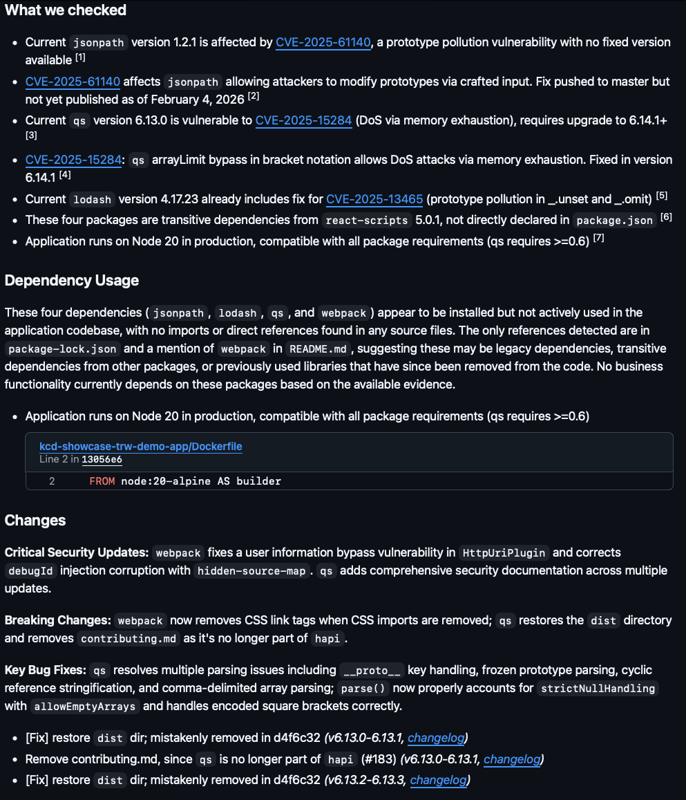
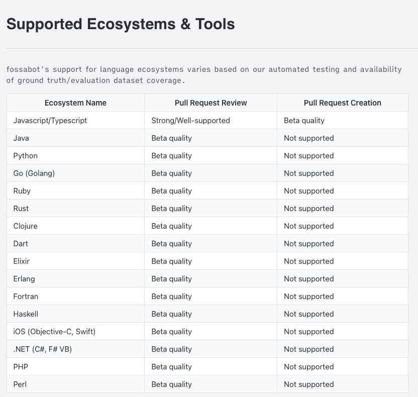
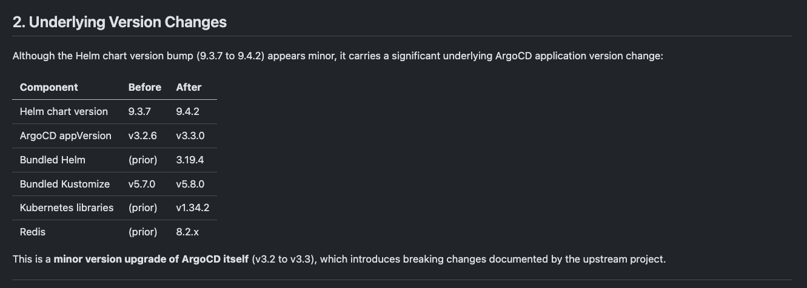
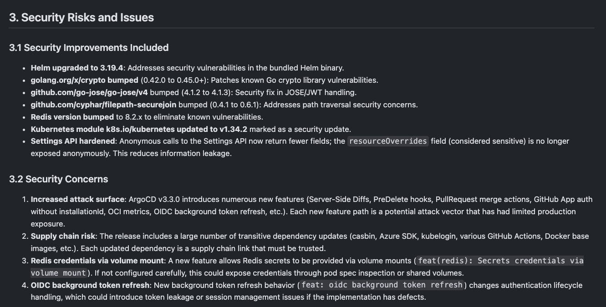

# Let the Bot Review it 

Reducing Toil with Fossabot

<!--
Hello Guys! I am happy to welcome you to my presentation. Today I am going to talk about pull request reviews - A basic which everyone encounters who works with git.
-->

---
layout: two-cols
---

# Julian Zhuang

**DevOps Engineer @ WhizUs GmbH**

- 🚀 Cloud Native & Kubernetes
- 🔧 CI/CD & GitOps practioner
- 🔒 Supply Chain Security enthusiast

::right::

<div class="flex items-center justify-center h-full">
  
</div>

<!--
Before we dive in, let me introduce myself. I'm Julian Zhuang, working as a DevOps Engineer at WhizUs. I'm passionate about Cloud Native technologies, GitOps, Supply Chain Security and finding ways to reduce toil with automation and AI.
-->

---
layout: lead
---

# Pull Request Reviews

Why they matter — and why they're hard

<!--
So what is a pull request? When you work as a team on a git project, you need to make changes to the codebase without interfering with other collaborators. It could be quite hard if multiple people are working on the same topics. For this, you usually create a development branch, which is a seperated workspace where you can conduct changes without impacting the main project. And at some point, you need these changes in your main project. That's why we need pull requests.
A pull request is a collaborational feature and describes the proposal to merge code changes from a branch to the mainproject. Everyone on the team can open a PR. Before a PR is merged, it should be ensured that the codebase is still working afterwards - therefore reviews are necessary.
-->

---

# What Is a PR Review? | The Basics

A Pull Request Review is a **quality gate** before code reaches production.

Reviewers check for:

- ✅ Correctness — does it do what it should?
- ✅ Security — does it introduce vulnerabilities?
- ✅ Dependencies — are upgrades safe?
- ✅ Breaking changes — will it break existing behavior?
- ✅ Best practices — is the code maintainable?

<!--
When you review a pull request, you want to make sure that the PR is not breaking existing functionality - Are there breaking changes? Dependency Updates? Does the change introduce vulnerabilities? Maintainability?
Therefore a Pull Requests Review is acting as quality gate and is really important for maintaining code bases.
-->

---

# The Challenge | Manual Reviewing

In practice, manual reviews struggle with:

- 📦 **Dependency updates** — "just a version bump", but what changed upstream?
- ⏱️ **Time pressure** — reviewers skim diffs, approve quickly
- 🔗 **Transitive dependencies** — hidden changes deep in the tree
- 🧩 **Context gaps** — no one reads every changelog for every package
- 🔒 **Security blind spots** — CVEs introduced via minor/patch bumps

> **The more "boring" a PR looks, the more dangerous it can be.**

<!--
Pull Requests are quite manageable when the changes are transparent - you see what functionality is introduced, what parts of the code base are touched, are best practices followed etc. 

But this is not always easy. Sometimes you are dealing with not-so-transparent changes from the upstream, also called Dependency updates. For you, it looks like a minor update, but underneath it could include some breaking changes or introduce security vulnerabilities with transitive dependencies - hidden behind a minor update. You would need to crawl over releases & changelogs for quite some time, maybe hours, to just comprehend the change.  

On top of all that - this is eating a lot of time if you want to do it right. You basically have to take proper time to do a good review. 

So all in all, this is quite an effort to just keep a project running.
-->

---
layout: lead
---

# A Real-World Example

Let's look at a Dependabot PR from our CNDA demo application

<!--
So I have prepared a pull request example with our CNDA demo application we are maintaining for the Cloud Native Days in Austria.
-->

---

# The PR | CNDA Showcase App


**PR #39**: `chore(deps): bump the npm_and_yarn group with 4 updates`

```
jsonpath    1.1.1  →  1.2.1
lodash      4.17.21  →  4.17.23
qs          6.13.0  →  6.14.2
webpack     5.102.1  →  5.105.2
```

**Statistics**: 1 file changed (`package-lock.json`)

All minor/patch bumps. Would you approve this?

<!--
So this pull requests bumps 4 dependencies. All of them are minor & patch updates. Would you approve this as reviewer?
-->

---

<div class="overflow-y-auto h-full">
  
</div>

<!--
Yes, I would be cautious as well. This is a screenshot of the original Dependabot PR. To review this manually, I would have to check the release notes and change logs of each dependency, potentionally also looking into commits. 
And as you can see, not all dependency updates provide changelogs or release notes. Only qs and webpack have one, for the other two I would have to look for release notes on the respective GitHub repository, if there are any.
-->

---

**jsonpath 1.2.1**:



<!--
Yes, jsonpath doesn't have release notes or changelogs at all for proposed 1.2.1 update. This is a typical case where I would have to look into the commit.
-->

---

**jsonpath commit for 1.2.1**:
<div class="overflow-y-auto h-full">
  
</div>

<!--
And this is the commit for proposed version 1.2.1. I am not sure how about you guys, but this looks inconspicious to me, not introducing any issues.
-->

---

# What's Actually Hiding | Security Issues

| Package | CVE | Severity | Status |
|---------|-----|----------|--------|
| `jsonpath` 1.2.1 | CVE-2025-61140 | 🔴 Prototype Pollution | **No fix available!** |
| `qs` 6.13.0 | CVE-2025-15284 | 🔴 DoS via memory exhaustion | Fixed in 6.14.1+ |
| `lodash` 4.17.23 | CVE-2025-13465 | 🟡 Prototype Pollution | Fixed in this version |
| `webpack` | User info bypass | 🟡 HttpUriPlugin | Fixed in this version |

**Upgrading `jsonpath` actually introduces a known, unfixed CVE!**

<!--
Yes, I wouldn't have approved as well. The pull request fixes some vulnerabilities, but also introduces a new flaw for jsonpath version 1.2.1, which would have land in my production environment.
For the human eye, this is a really hard catch.
-->

---

# The Irony | Patch Bumps ≠ Safe

This PR is supposed to **fix** things, but:

1. `jsonpath` 1.2.1 ships **with** CVE-2025-61140 — no patched version exists yet
2. The fix was pushed to `master` but **not published to npm**
3. Merging this PR puts a known vulnerable package into production
4. A human reviewer would never catch this from the diff alone

> **Minor/patch bumps can introduce security vulnerabilities.**

<!--
So I hope my message is clear, as long as pull requests are transparent, reviews are easy.
But when the changes are intransparent, reviewing becomes quite a toil and even patch bumps are not safe.
-->

---
layout: lead
---

# How Can AI Help?

Automated analysis beyond the diff

<!--
This is where AI comes into play. AI powered pull request reviews can help me save massive amounts of time for intransparent changes.
-->

---

# AI PR Review | The Concept

Instead of reviewing just the diff, AI can:

- 🔍 **Research upstream changelogs** across all updated packages
- 🔒 **Cross-reference CVE databases** for every dependency version
- 📋 **Analyze transitive dependency trees** for hidden risks
- ⚠️ **Flag breaking changes** even in minor/patch bumps
- 🛠️ **Suggest actionable fixes** with specific commands
- 📝 **Generate testing checklists** tailored to the changes

<!--
So for example, the AI can help me check all the upstream changelogs for breaking changes, find CVE's for every dependency version, analyzing transitive dependencies, suggesting fixes as comment and much more.
-->

---

# Fossa & Fossabot

**Fossa** is a supply chain security platform that helps teams manage:
- 📦 Dependencies & licenses
- 🔒 Security vulnerabilities (CVE scanning)
- 📋 Compliance with licensing requirements
- 🐙 Requires GitHub.com

**Fossabot** is Fossa's AI-powered PR review assistant:
- 🤖 Automatically reviews dependency update PRs
- 🔍 Analyzes changelogs, CVEs, and breaking changes
- 💬 Comments directly on GitHub/GitLab PRs
- ⚡ Works for npm, Maven, PyPI, Go modules, and more
- 🔒 Uses LLM & AI services from Anthropic through an enterprise agreement - no training or data retention

<!--
So for this, I have taken a look into the supply chain platform "Fossa" and their AI reviewing tool "fossabot". Fossa is a supply chain security platform focusing on dependency management, security scanning, and license compliance.
Fossabot is their AI assistant that automatically reviews pull requests on GitHub with dependency updates, particularly useful for catching issues in Dependabot PRs. It is using LLM's and AI services from Anthropic with an enterprise agreement, claiming the data here are not used for training or retention. 

It's not free, they have an enterprise subscription but you have a monthly credit of 15$ in the free tier included.
-->

---

# Fossabot | AI Review for the CNDA App

<div class="overflow-y-auto h-full">
  
</div>

<!--
So, I have let the bot review the pull request and I was very surprised how well it could analyze. It detected that the upcoming updates for lodash and qs were fixing vulnerabilities, while the update for jsonpath 1.2.1 is introducing a security flaw. Fossabot also gave me some suggestions how could I proceed now, like replacing jsonpath with an alternative.
-->

---

# Fossabot | AI Review for the CNDA App

<div class="overflow-y-auto h-full">
  
</div>

<!--
It also adds a bunch of other useful information, such as the dependency usage. Although jsonpath 1.2.1 is introducing a new vulnerability, it is not actively used in the apps code base, which indicates this can be either removed or is a transitive dependency from another dependency. 

It also includes a list of potential breaking changes, which is good to know.
-->

---

# Fossabot | What It Checked

Fossabot automatically analyzed:

- ✅ CVE databases for all 4 packages
- ✅ Whether packages are direct or transitive dependencies
- ✅ Actual usage in the application source code
- ✅ Breaking changes in changelogs
- ✅ Runtime compatibility (Node 20)
- ✅ Fix availability and timelines

All of this — **in 5-10 minutes**, on every PR, automatically.

<!--
So to sum up, Fossabot did exactly what I was suspecting from AI reviews and more. It could detect vulnerabilities and breaking changes as expected, but also provide information on the dependency context and suggestions how to proceed.
The whole PR analysis took about 5 to 10 minutes.
-->

---

# Fossabot | Supported Ecosystems & Tools

<div class="overflow-y-auto h-full">
  
</div>

<!--
Fossabot is also supporting a wide range of ecosystems, especially JS/TS ecosystems work amazingly well. Java, Python, Go, .NET are supported on Beta quality for now & will be improved in future.
-->

---
layout: lead
---

# And For DevOps?

Helm Charts, Pipelines, Infrastructure-as-Code

<!--
For DevOps, this is a different story, where you work with Helm Charts, YAML pipelines or any infrastrucute as code repository.
-->

---

# The DevOps Problem | Same Pattern, Higher Stakes

DevOps PRs follow the same pattern:

```diff
dependencies:
  - name: argo-cd
-    version: 9.3.7
+    version: 9.4.2
    repository: https://argoproj.github.io/argo-helm
```

**1 file changed, 1 line added, 1 line deleted.**

<!--
But we have basically the same problem here. Dependabot might have created a version bump for your Helm Chart, which could introduce the same issues as we have seen with the pull request for our CNDA demo application.
-->

---

# Fossabot's Limitation | DevOps Ecosystem

Fossabot works great for **Javascript/Typescript ecosystems**:

- ✅ React, Node.js, frontend dependencies
- ✅ CVE cross-referencing for npm packages
- ✅ Dependency usage analysis in JS/TS source

But for **DevOps artifacts**, it falls short:
- ❌ No Helm chart changelog analysis
- ❌ No understanding of Kubernetes breaking changes
- ❌ No ArgoCD/Flux upgrade guide awareness
- ❌ No infrastructure-level impact assessment

**We need something for DevOps PRs.**

<!--
The issue here is, we can't use Fossabot for DevOps related repositories, as it only supports certain ecosystems. There is no Helm Chart analysis, no understanding of yaml files, no upgrade awareness and no infra level impact assessment.
-->

---
layout: lead
---

# AI Reviews with Claude Opus

Deep analysis for DevOps Pull Requests

<!--
And therefore I have found another way, which can be essentially used by anyone here in the room.
-->

---

# The Approach | Claude Opus

Using Claude (Opus) we can build **deep PR reviews**:

1. Feed the PR diff + upstream changelogs + upgrade guides
2. Ask for breaking changes, security risks, migration steps
3. Get a structured review with risk assessment

Let's see what Claude found for the ArgoCD bump...

<!--
So the idea is, we want our DevOps pull requests still to be reviewed by AI, but not from Fossabot, but from your day-to-day AI client. 
I found it feasible to send Claude Opus my pull request + instructions to let him review & provide me breaking changes, security risks and suggestions.
-->

---

# Instructions

```
Please review following pull request: https//www...
- these instructions should be used when reviewing Pull Requests
- point out the changes on a surface level
- point out security risks and issues. If possible, write full CVE name, which CVE's has been fixed and which new ones are introduced.
- although this is a minor update, there could still be underlying breaking changes (e.g. from underlying dependencies). Point these out as well
- do not use emojis
- you can use gh cli
- dump your results in a new file (naming convention PR-<number>-REVIEW.md). If a file is already existing, create a new file and increment <number>.
```

<!--
This is the instruction file. I wanted for the pull request to have a changelog on surfacelevel, potentional security issues and breaking changes with the version updates. Considering how inaccurate this instruction file has been written, the result from Opus is quite astonishing.
-->

---

# What Claude Found | The ArgoCD PR

What looks like a 1-line change actually contains:

- 📊 **16 commits** between chart versions
- 🚨 **Major version jump**: ArgoCD v3.2.6 → v3.3.0
- 💥 **Breaking changes**: SSA now default sync strategy
- 🔒 **Security fixes**: Helm 3.19.4, Go crypto patches, Redis
- ⚠️ **CRD size limit**: `kubectl apply` will fail
- 📋 **Multiple upgrade guides** to review (v2.14 → v3.3!)

<!--
So this is a short overview of the result. Claude Opus were able to find underlying version bumps, breaking changes and security fixes as described in the instructionsfile.
-->

---

# What Claude Found | The ArgoCD PR

  

<!--
These were the version changes coming with just 1 line of ArgoCD Helm Chart Upgrade. Claude Opus detected at this point that one of the version changes introduces breaking changes.
-->

---

# What Claude Found | The ArgoCD PR

  

<!--
Here Opus found that proposed Helm Chart update would fix some of the vulnerabilities, such as Redis pre. 8.2.x and also potential security concerns such as supply chain risk. But I don't think that all concerns greatly matters - for example the supply chain risk is real, but self-explanatory at the same time. I see here potential to improve the feedback from Opus with more accurate instructions in the instructionsfile.
-->

---

# Breaking Change #1 | CRD Size Limit

The ApplicationSet CRD exceeds the 262144-byte annotation limit:

```
The CustomResourceDefinition "applicationsets.argoproj.io" is invalid:
metadata.annotations: Too long: may not be more than 262144 bytes
```

- ❌ `kubectl apply` will **fail**
- ✅ `helm upgrade` is **not affected**
- ⚠️ Self-managing ArgoCD must use SSA

<!--
This will break client-side manual upgrades e.g. kubectl apply, but will do nothing if ArgoCD is managed as Helm Chart. If ArgoCD is self-managed, it's necessary to set ServerSideApply to true.
-->

---

# Breaking Change #2 | New Health Checks

New health checks may change application status unexpectedly:

- `ceph.rook.io/CephCluster`, `CephObjectStore`
- `keda.sh/ScaledJob`
- `services.cloud.sap.com/ServiceBinding`
- `*.cnrm.cloud.google.com/*` (GCP Config Connector)

**Impact**: Apps previously marked "Healthy" may now show different statuses.

This can trigger alerts and break automated workflows!

<!--
Opus found some health check related changes, which could trigger alerts in production environments. Applications previously marked as healthy according to these health checks may be impacted.
-->

---

# Risk Matrix | Claude's Assessment

| Risk Factor | Level | Notes |
|-------------|-------|-------|
| CRD size limit (self-managed) | 🔴 HIGH | Requires SSA pre-config |
| SSA default change | � HIGH | Fundamental behavioral shift |
| Health check changes | 🟡 MEDIUM | Status transitions |
| Kustomize namespace fix | 🟡 MEDIUM | May alter manifests |
| Supply chain | 🟡 MEDIUM | Many transitive updates |
| Stale appVersion | 🟢 LOW | Cosmetic but misleading |

<!--
Opus also generated a risk matrix for us to estimate the security vulnerabilities and breaking changes plus additional notes.
-->

---

# Claude's Verdict | Conditional Approval

### DO NOT MERGE BLINDLY

Despite being a one-line change:

1. ✅ Read **all** upgrade guides (v2.14 → v3.0 → v3.1 → v3.2 → v3.3)
2. ✅ Deploy to staging environment first
3. ✅ Enable `ServerSideApply=true` if self-managing
4. ✅ Update wrapper chart `appVersion` to `v3.3.0`
5. ✅ Monitor for 24-48 hours
6. ✅ Have rollback plan ready

<!--
And this is the final result of Claude Opus analysis, it doesn't just give an justification, but also gives you next steps how you should proceed after merging your pull request.
-->

---
layout: lead
---

# The Comparison

Fossabot vs. Claude — different strengths

---
layout: two-cols
---

# Fossabot | JS/TS

**Strengths:**
- ✅ Automatic on every PR
- ✅ CVE database cross-referencing
- ✅ Dependency usage analysis
- ✅ Fix suggestions with commands
- ✅ Free & easy to set up

**Limitations:**
- ❌ requires GitHub.com
- ❌ dev ecosystems only
- ❌ No Helm/K8s awareness
- ❌ No infrastructure context

::right::

# Claude | DevOps/Infra

**Strengths:**
- ✅ Deep changelog analysis
- ✅ Helm/K8s breaking changes
- ✅ Multi-version upgrade paths
- ✅ Security risk assessment
- ✅ Migration step generation

**Limitations:**
- ❌ Requires manual prompting
- ❌ No automatic PR integration (yet)
- ❌ Needs context feeding

<!--
So all in all, I reviewed both AI tools and must say, that Fossabot delivered better review results, because the information were on point - it delivered me actual CVE numbers, dependency context, breaking changes and suggestions while taking roughly 5-10 minutes. Sadly this is only for app development ecosystems.

Claude Opus on the other hand performed slightly worse on the analysis part - No actual CVE numbers and a lot more "noise" information, but the analysis took less than 5 minutes and doesn't cost additional money apart from the AI subscription (where Opus is most-likely included). I think this is not a bad tradeoff for DevOps repositories and has potential to save me a lot of time.
-->

---
layout: lead
---

# Key Takeaways

What we learned

<!--

-->

---

# The Core Message | Never Trust the Diff

### What a human reviewer sees
> "Bump 4 npm packages" — minor/patch versions ✅
> "Bump argo-cd from 9.3.7 to 9.4.2" — 1 line changed ✅

### What AI uncovers
- � Known CVEs **introduced** by the update
- 🚨 Breaking changes hidden behind semver
- 🔒 Security implications in transitive deps
- ⚠️ Migration requirements spanning multiple versions

<!--
- intransparent changes are hard to review
- takes a lot of time
- AI reviews can identify CVE's
- AI reviews can identify breaking changes
- AI reviews can identify security implications
-->
---
layout: two-cols
---

# Human + AI | Better Together

**Humans excel at:**
- Business context
- Architecture decisions
- Risk tolerance judgment
- Stakeholder communication

::right::

## &nbsp;

**AI excels at:**
- Reading changelogs exhaustively
- Tracking transitive dependencies
- Identifying breaking changes
- Generating migration steps
- Security vulnerability analysis

---
layout: center
class: "text-center"
---

# Thank You!

**Let the Bot Review it** — Reducing Toil with Fossabot

[WhizUs](https://www.whizus.com) / [ArgoCD](https://argo-cd.readthedocs.io) / [Slidev](https://sli.dev)
